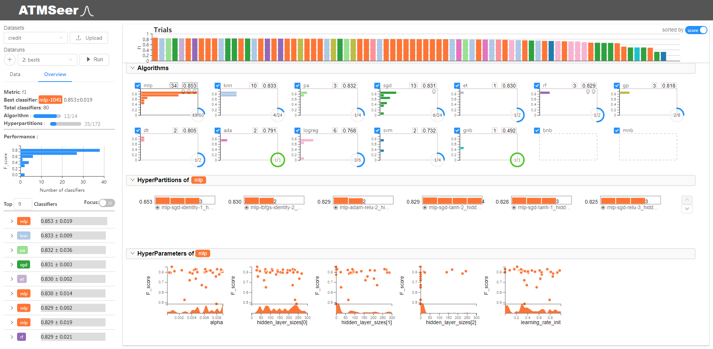

# ATMSeer: Increasing Transparency and Controllability in Automated Machine Learning

ATMSeer can help you monitor, analyze, and refine an AutoML process in real time.

### Demo

A demo is available [here](http://atm.hkustvis.org)





=========================

# Download ATMSeer

```
git clone https://github.com/HDI-Project/ATMSeer.git /path/to/atm
```

# Build a virtual enviroment
```
cd /path/to/atm
virtualenv venv
. venv/bin/activate
```

# Setup ATM

### Clone ATM as a submodule
First, run the following commands to clone ATM as a submodule

```
git submodule init
git submodule update
```

### Install a database
Then, go to `lib/atm`

You will need to install the libmysqlclient-dev package (for sqlalchemy)

```
sudo apt install libmysqlclient-dev
```

and at least one of the following databases.

- for SQLite (simpler):
```
sudo apt install sqlite3
```

- for MySQL:
```
sudo apt install mysql-server mysql-client
```

**Note:** as the scikit_learn has been updated and the new version of it is not compatible with current version of ATM, you should run the following commands

```
pip uninstall scikit_learn
pip install scikit_learn==0.19.2
```

### Install python dependencies for ATM.
```
python setup.py install
```


# Setup the server for ATMSeer
After configuring the ATM, then go to `server/` and run `pip install -r requirements.txt`


# Run
Go to root directory
Set `$PYTHONPATH` to include the local `atm_server` package:
```bash
export PYTHONPATH=$PYTHONPATH:`pwd`/server/
```

### Production Mode
At root directory, start the atm server by:
```
python server/atm_server/server.py
```

Build the frontend

```
npm install
npm run build
```

Then, access `http://localhost:7777/` at your web broswer to see the ATMSeer.

## Development Mode


At the root directory, start the atm server by:
```
python server/atm_server/server.py --debug
```

Start the front end at developer modo:

```
npm install
npm start
```

You can access the `http://localhost:7779/` to see the ATMSeer.

# Build

## Build and Deploy with Docker

Run `scripts/build_with_docker.sh` to build the docker image

Run `scripts/start_docker.sh` to start the app
